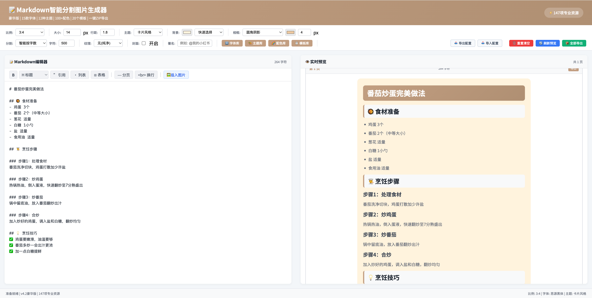

# 📝 Markdown 智能分割图片生成器

一款强大的在线工具，将 Markdown 文本智能分割并转换为精美图片，适用于小红书、公众号、Instagram 等社交平台发布。



参考：[text](https://github.com/xiaolinbaba/Madopic)

## ✨ 主要功能

### 🎯 核心功能
- **智能分割**：自动将长文本按段落或字数分割成多张图片
- **实时预览**：所见即所得，实时查看生成效果
- **一键导出**：支持单张图片导出或批量 ZIP 打包下载

### 🎨 丰富的自定义选项
- **15 款精选字体**：包括思源黑体/宋体、手写体、等宽代码字体等，所见即所得的“字体库”预览
- **12 种 Markdown 主题**：从极简线条、经典印刷到现代商务、文艺纸质风
- **100+ 配色方案**：8大色系自由选择，一键切换整体页面色调
- **配置导入/导出**：将精心调节好的排版参数一键保存为 `.json`，方便日后或跨设备复用

### ⚡ 极速编辑体验
- **悬浮富文本工具栏**：无需记忆 Markdown 语法，一键插入加粗、多级标题、引用、列表、表格、分页符等
- **智能本地图片插入**：支持选择本地图片，自动进行高清压缩并转存为 Base64 嵌入文本中，丝滑不卡顿

### 📐 多平台尺寸适配
- **小红书** (3:4) - 竖屏最佳比例
- **Instagram** (1:1) - 正方形经典比例
- **PPT** (4:3) - 演示文稿标准比例
- **微信公众号** (16:9) - 横屏宽幅展示
- **竖屏视频** (9:16) - 短视频平台适配

## 🚀 使用方法

### 第一步：打开工具
使用现代浏览器（Chrome、Edge、Safari、Firefox）双击打开 `markdown-to-images-v4.2.html` 文件即可使用，无需启动本地服务器，纯离线单文件应用。

### 第二步：输入内容
在左侧编辑区输入或粘贴你的 Markdown 文本，**或者使用左侧上方悬浮工具栏快捷插入：**
- 支持直接插入标题（H1-H6）、加粗、引用、无序列表、表格等
- 强制分页符（`---`）：在你想断开新图片的位置使用
- 插入本地图片（🖼️）：点击选择本地图片，会自动进行不卡顿压缩并插入文中
```markdown
# 我的标题

这是一段普通文字。

## 小标题
- 列表项 1
- 列表项 2

**重点内容** 和 *斜体文字*
```

### 第三步：调整样式
使用顶部控制栏快速调整：
- **平台选择**：选择目标社交平台，自动适配尺寸
- **字体选择**：从 15 款字体中选择合适的风格
- **主题选择**：选择 Markdown 代码高亮主题
- **模板应用**：一键应用专业配色方案
- **颜色调整**：自定义背景色、文字色、强调色
- **分割设置**：设置每张图片的最大字符数

### 第四步：保存与导出
- **导出单张**：鼠标悬停在右侧预览卡片上，点击“下载”图标。
- **批量导出**：点击“📦 全部导出”一键打包所有生成的高清长图。
- **保存/分享配置**：满意当前排版？点击“📤 导出配置”保存为 `.json`，下次“📥 导入配置”即可无缝复原。
- **重置画布**：点击“🗑️ 重置清空”可以一键清空草稿和恢复所有初始设置。

## 💡 使用技巧

### 智能分割建议
- **短文内容**：建议设置 300-500 字符/页
- **长文章**：建议设置 500-800 字符/页
- **代码展示**：建议设置 200-400 字符/页，使用等宽字体

### 平台发布建议
- **小红书**：使用 3:4 比例，选择清新主题和手写字体
- **微信公众号**：使用 16:9 比例，选择专业主题和思源字体
- **Instagram**：使用 1:1 比例，注重配色的视觉冲击力
- **技术博客**：使用代码主题（Monokai、Dracula），配合等宽字体

### 保存与复用
- **导出配置**：点击控制台右上方的“📤 导出配置”保存当前所有设置，生成 JSON 文件。
- **导入配置**：点击“📥 导入配置”快速复用之前的自定义样式（字体、颜色、尺寸、水印、主题等）。
- **重置所有**：点击“🗑️ 重置清空”可以一键复位整个编辑器。

## 🎨 内置排版模板
内置 20 个高颜值的专业行业排版模板：
- **自媒体分类**：如 小红书（时尚/美妆/家居）、公众号（科技/新闻/教育）等。
- 点击顶部控制栏的“📋 模板库”即可一键换装。

## 📝 支持的 Markdown 语法

- 标题（# ## ### #### ##### ######）
- **粗体文本**
- *斜体文本*
- ~~删除线~~
- `行内代码`
- 代码块（```语言 ... ```）
- 无序列表（- * +）
- 有序列表（1. 2. 3.）
- 引用（> 引用内容）
- 表格（| 列 | 列 |）
- 链接（[文字](网址)）
- 图片（或直接上传本地图生成 Base64）
- 分隔线/分页（--- 或 ***）
- 强制换行（&lt;br&gt;）

## ⚙️ 系统要求

- **浏览器**：Chrome 90+、Edge 90+、Safari 14+、Firefox 88+
- **网络**：首次使用需要联网加载字体和依赖库
- **分辨率**：建议 1920x1080 或更高分辨率显示器
- **性能**：现代电脑即可流畅运行，生成大量图片时需要较好性能

## 🔧 常见问题

**Q: 如何离线使用？**  
A: `markdown-to-images-v4.2.html` 已经是纯正的单文件应用。只要网络畅通的情况下在浏览器加载过一次字体和依赖库（如 marked.js/html2canvas.js），浏览器会有缓存，以后你可以断开网络双击打开文件使用（字体可能会降级为系统默认字体）。若需完全脱机部署，你可以将头部引用的 CDN 的 `js` 下载至本地同目录修改路径即可。

**Q: 插入本地图片卡顿怎么办？**  
A: 系统会自动检测上传的大体积图片，并在内存中通过 Canvas 进行压缩和降级处理再转成 Base64 嵌入文本。建议避免插入单张超 `5MB` 的未压缩巨幅相片。

**Q: 为什么首次打开较慢？**  
A: 首次需要从 CDN 加载字体和依赖库。后续使用浏览器缓存，速度会大幅提升。

**Q: 导出的图片为什么模糊？**  
A: 工具默认使用 2倍 分辨率导出，确保高清晰度。如果仍模糊，可能是系统显示器的缩放设置影响，建议浏览器缩放比例设置为 100%。

**Q: 为什么我修改了标题的字体但没有变化？**  
A: 点击右上角 **🔤 字体库** 重新选择一次字体。选中的全局字体会优先覆盖任何主题中的默认字体排版。

## 📞 技术特性

- **零安装 / 单文件应用 (SFA)**：纯净的单 HTML 文件包含所有排版模板、预设配置与样式
- **隐私安全**：所有的 Markdown 解析和图像拼接均在浏览器本地运算完成，完全无云端通信、无数据泄露风险
- **跨平台**：支持 Windows、macOS、Linux 任意操作系统
- **轻量高效**：使用 html2canvas 进行高质量截图渲染
- **即时响应**：实时预览，无延迟交互体验

---

💖 **享受创作，让内容更美！**
